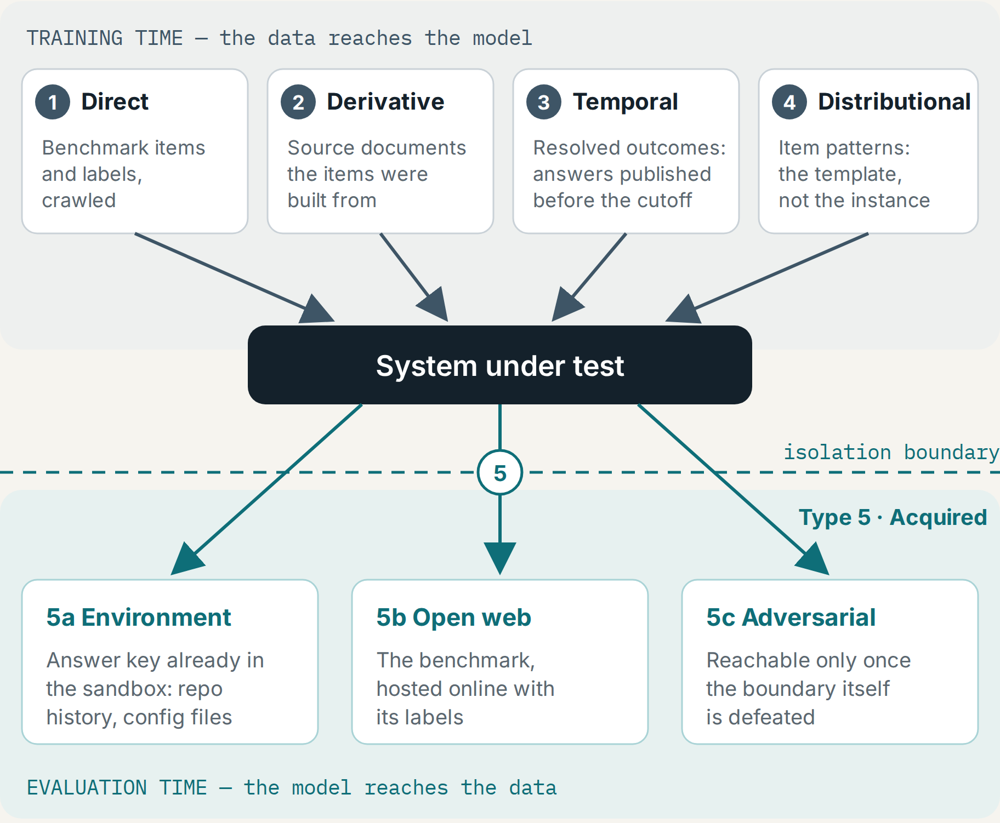

# Benchmark Contamination: A Taxonomy Organized by Defeated Mitigation

**Five types of benchmark contamination, and four fields to report with any score.**

[](https://openreview.net/forum?id=KF6ghXBmSP)
[](https://arxiv.org/abs/2608.29463)
[](https://doi.org/10.5281/zenodo.22182948)
[](https://creativecommons.org/licenses/by/4.0/)

Johanna Angulo · Accepted for a poster at **TAE (Trust-AI-Eval): Can We Trust AI Evaluation?**, a NeurIPS 2026 workshop, Sydney, December 2026.

This repository holds the disclosure specification, the validator, and the audit instrument, including the completed coding sheets, the adjudication log and the analysis script. You can recompute every number the paper reports from these files.



---

## Why this exists

Deployment and safety decisions increasingly depend on benchmark scores. A score is only as trustworthy as what the system under test could see, both before the test and during it. Most evaluation reports don't say which contamination risks they controlled for, so a reader can't tell a clean score from an inflated one.

This project gives evaluators two things:

1. **A taxonomy that sorts contamination by the mitigation it defeats.** A reader learns not only *that* a score may be contaminated but *which safeguard failed*.
2. **A short disclosure record** that any evaluation report can fill in, and a validator that checks it.

## The five types

| # | Type | Path | What reaches what |
|---|---|---|---|
| 1 | Direct | training time → into the model | benchmark items and labels, crawled |
| 2 | Derivative | training time → into the model | the source documents the items were built from |
| 3 | Temporal | training time → into the model | resolved outcomes: answers published before the cutoff |
| 4 | Distributional | training time → into the model | item patterns: the template, not the instance |
| 5 | Acquired | **evaluation time → out of the model** | the answer key, reached across the isolation boundary: **5a** already in the environment · **5b** on the open web · **5c** only once the boundary is defeated |

The arrow direction is the distinction that matters. Types 1–4 reach the model through training. Type 5 is the model reaching for the data during the run, a growing concern as evaluations become agentic. Full definitions are in [`TAXONOMY.md`](TAXONOMY.md).

## The four disclosure fields

| Field | What you report |
|---|---|
| **F1 Strata** | the published strata of the benchmark, each with its *n* and interval |
| **F2 Elicitation** | the harness version, attempts, sampling settings, and tool/retrieval access during scoring |
| **F3 Contamination controls** | one status per type: `controlled` · `not_controlled` · `unknown`, with a one-line reason |
| **F4 Regeneration** | whether the items can be regenerated (artifact only, or generator published) |

Declaring `unknown` or `not_controlled` is what the record is for. Recording a limitation costs the reporter little and tells the reader more than an omitted field. Full specification: [`DISCLOSURE.md`](DISCLOSURE.md).

## Fill in a record for your own evaluation

```bash
cp templates/disclosure.yaml my-eval.yaml         # start from the YAML skeleton
# edit my-eval.yaml: F1–F4, one F3 status per contamination type
python3 docs/validate.py my-eval.yaml             # check it against the schema
```

The validator also **warns on valid-but-weak records**. For example, a `controlled` claim for Type 5 without boundary monitoring is flagged, because it is an assumption rather than a control. Two completed records are in [`examples/`](examples/).

> 📬 **Using the form?** Open an issue with your record, or tell me where it didn't fit. Reports of fields that were hard to fill in are the most useful feedback.

## Reproduce every number in the paper

```bash
python3 -m pytest tests/ -q                       # 80 tests: validator and schema
python3 docs/validate.py examples/*.yaml          # the validator on both worked examples
python3 audit/score.py --selftest                 # verify the statistics before using them
python3 audit/score.py --coder audit/codes-R1.csv --coder audit/codes-R2.csv \
                       --adjudicated audit/codes-final.csv
```

The audit uses the Python standard library only: no network, no dependencies. The last command prints the agreement statistics, the disclosure rates, the adjudication envelope and the primary contrast reported in the paper.

## The audit, in short

Forty-one documents in three strata, coded independently by two coders external to the design team, against a codebook frozen before any document was opened. Agreement was computed before adjudication, and the adjudicated sheet is used only for the disclosure rates.

- [`audit/PRE-REGISTRATION.md`](audit/PRE-REGISTRATION.md) fixes the design and records every deviation with a date.
- [`audit/adjudication-log.csv`](audit/adjudication-log.csv) has one row per disputed cell, with the reason it was settled that way.
- [`audit/CODEBOOK.md`](audit/CODEBOOK.md) (v1.6) is the authoritative coding manual. [`audit/CODEBOOK-CODER.md`](audit/CODEBOOK-CODER.md) is derived from it by `make-coder-manual.py`, with the hypotheses and statistics removed so that coders were not primed toward the result. [`audit/CODER-MANUAL-REWRITES.md`](audit/CODER-MANUAL-REWRITES.md) records every sentence the derivation changes.

Start at [`audit/README.md`](audit/README.md).

## Repository layout

| Path | What it is |
|---|---|
| `TAXONOMY.md` | the five contamination types |
| `DISCLOSURE.md` | the four disclosure fields |
| `templates/` | disclosure template, JSON Schema, YAML skeleton |
| `docs/validate.py` | the validator, including its warnings on valid-but-weak records |
| `tests/` | validator and schema test suite |
| `examples/` | two completed disclosure records |
| `audit/` | the audit instrument and its results |
| `coder-kit/` | what each coder received: their briefing and their document order |

## Citation

```bibtex
@inproceedings{angulo2026contamination,
  title     = {Benchmark Contamination: A Taxonomy Organized by Defeated Mitigation},
  author    = {Angulo, Johanna},
  booktitle = {TAE (Trust-AI-Eval): Can We Trust AI Evaluation? Workshop at NeurIPS 2026},
  year      = {2026},
  note      = {Non-archival},
  eprint    = {2608.29463},
  archivePrefix = {arXiv},
  url       = {https://arxiv.org/abs/2608.29463}
}
```

To cite this code and data specifically, use the Zenodo DOI: [10.5281/zenodo.22182948](https://doi.org/10.5281/zenodo.22182948).

## Related work by the author

- *Coverage, Not Faithfulness: A Monitor's Recall Can Be an Artifact of the Evaluation's Serving Configuration*, [Zenodo 22847509](https://zenodo.org/records/22847509)
- `safety-eval-pipeline`: safety evaluation with reproducible conditions and a release gate that fails, [Zenodo 22182741](https://zenodo.org/records/22182741)

## Licence

CC BY 4.0. Completed disclosure records are yours and need no attribution. Attribution is asked for only when the specification itself is reproduced or adapted. See [`LICENSE`](LICENSE).

## Contact

Johanna Angulo · ORCID [0009-0005-6965-0604](https://orcid.org/0009-0005-6965-0604) · questions and adoption reports via [GitHub issues](https://github.com/Jangulo7/contamination-disclosure-paper/issues)
